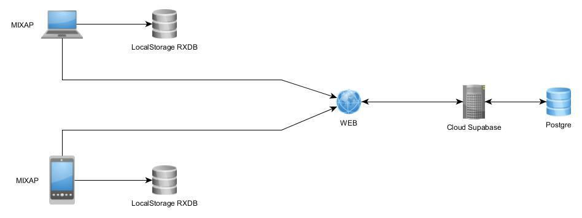

# MIXAP 
I am not owner of this project this is a fork

## Contents  

- [MIXAP](#mixap)
  - [Contents](#contents)
  - [1 Project Overview](#1-project-overview)
  - [2 Project Architecture](#2-project-architecture)
    - [2.1 Key Folders](#21-key-folders)
  - [3 Technology Stack](#3-technology-stack)
    - [3.1 Frontend: React + TypeScript](#31-frontend-react--typescript)
    - [3.2 Backend: Supabase](#32-backend-supabase)
    - [3.3 Build Tool: Vite](#33-build-tool-vite)
    - [3.4 Augmented Reality (AR) Technologies](#34-augmented-reality-ar-technologies)
  - [4 Development Practices](#4-development-practices)
    - [4.1 Component-Based Architecture](#41-component-based-architecture)
    - [4.2 State Management](#42-state-management)
    - [4.3 API Communication](#43-api-communication)
    - [4.4 Internationalization (i18n)](#44-internationalization-i18n)
    - [4.5 Code Conventions](#45-code-conventions)
  - [5 Conclusion](#5-conclusion)
  - [Documentation de couchDb (permet de faire les requêtes)](#documentation-de-couchdb-permet-de-faire-les-requêtes)
- [Instalation sous Windows](#instalation-sous-windows)
  - [Prérequis](#prérequis)
    - [Cloner le dépôt du projet via Github Desktop ou via la commande *git clone*](#cloner-le-dépôt-du-projet-via-github-desktop-ou-via-la-commande-git-clone)
    - [Instalation de NVM et de Supabase](#instalation-de-nvm-et-de-supabase)
  - [Configurez ensuite la base de données Supabase en suivant la procédure du document](#configurez-ensuite-la-base-de-données-supabase-en-suivant-la-procédure-du-document)
  - [Docker :](#docker-)
  - [Connexion avec la Supabase](#connexion-avec-la-supabase)
  - [Relancez le conteneur MIXAP :](#relancez-le-conteneur-mixap-)
  - [Découverte de l'application](#découverte-de-lapplication)
- [Instalation sous Linux](#instalation-sous-linux)
  - [Prérequis](#prérequis-1)
  - [Fonctionnement](#fonctionnement)
  - [Installation](#installation)
  - [Découverte de l'application](#découverte-de-lapplication-1)

---

## 1 Project Overview  
Mixap is an Augmented Reality (AR) educational authoring tool, designed to help teachers and content creators build engaging, interactive learning activities. By leveraging modern web technologies, Mixap allows for a seamless AR experience through a web-based interface.

## 2 Project Architecture  
The Mixap project is organized for modularity and maintainability. Below is an overview of the core directories and their roles:

- **.vscode** : Configuration files for Visual Studio Code.  
- **nodemodules** : External dependencies installed via npm or yarn.  
- **public** : Public assets and configuration files for deployment.  
- **scripts** : Utility scripts used for deployment.  
- **src** : The source code for the entire application.  
    - **assets** : Static assets such as images, fonts, videos, and icons.  
    - **components** : Reusable UI components, built using React and TypeScript.  
    - **db** : Database connection and schema definitions, primarily using Supabase and Prisma.  
    - **features** : Core application features, including ARView and the activity editor.  
    - **hooks** : Custom React hooks that manage state and handle reusable logic.  
    - **utils** : Utility functions used for general tasks throughout the application.  
- **App.css** : Global CSS styling for the app.  
- **App.tsx** : The main entry point for the React component tree.  
- **.env** : Environment variables for configuration.  
- **package.json** : Lists the project dependencies and scripts.

### 2.1 Key Folders  
- **public/** : Contains static assets, manifest files, and HTML templates.  
- **src/** : The main folder where the core logic, components, and features are implemented.  
- **components/** : Reusable React components like buttons, forms, and other UI elements.  
- **db/** : Handles database connections using Supabase and provides schema definitions.  
- **features/** : Contains key application features, such as the activity editor and AR view.  
- **hooks/** : Custom React hooks encapsulating state management logic.  
- **utils/** : General utility functions used across the app.  
- **i18n/** : Internationalization (i18n) files for multilingual support.

## 3 Technology Stack  
Mixap is built using a modern web technology stack, optimized for performance, scalability, and ease of development.

### 3.1 Frontend: React + TypeScript  
- **React** : We use React for building the user interface. React’s component-based architecture allows for code reuse and modularity.  
- **TypeScript** : TypeScript provides type safety and allows for better code maintainability, particularly in larger projects.

### 3.2 Backend: Supabase  
- **Supabase** : An open-source Firebase alternative that provides a Postgres database, authentication, and file storage. Mixap uses Supabase for managing users, activities, and AR content.

### 3.3 Build Tool: Vite  
**Vite** is used as the build tool for the project. It provides a fast development server with Hot Module Replacement (HMR), allowing for real-time code updates without refreshing the browser.

### 3.4 Augmented Reality (AR) Technologies  
Mixap uses several AR technologies to create browser-based AR experiences:

- **Three.js** : A 3D JavaScript library for rendering AR content.  
- **AR.js** : An open-source library that allows AR experiences to run in the browser without requiring a native app.

## 4 Development Practices  

### 4.1 Component-Based Architecture  
Mixap is built using React’s component-based architecture. Each component represents a distinct part of the UI or functionality. Components are designed to be reusable, enabling a consistent UI across the application.

### 4.2 State Management  
Local component state and React context are used to manage the app’s state. Custom hooks help in encapsulating complex state management logic for easier reuse.

### 4.3 API Communication  
Mixap interacts with Supabase via API requests to store and retrieve user data, AR activities, and other app resources. These API calls are handled within the db/ directory.

### 4.4 Internationalization (i18n)  
Mixap supports multiple languages, such as English and French, using internationalization libraries. Translation files are stored in the i18n/ folder.

### 4.5 Code Conventions  
We follow the following code conventions:

- **TypeScript** : Type safety is enforced throughout the codebase.  
- **ESLint and Prettier** : Code linting and formatting are handled using ESLint and Prettier, ensuring consistent code style.

## 5 Conclusion  
This documentation provides an overview of the Mixap project’s architecture, technology stack, and development practices. For more detailed explanations, you will find inline documentation within the codebase. Feel free to reach out to the team for any further clarification or assistance!


## Documentation de couchDb (permet de faire les requêtes)
https://docs.couchdb.org/en/stable/api/database/find.html


# Instalation sous Windows


## Prérequis


- Installer NVM https://github.com/coreybutler/nvm-windows/releases 
- Installer Docker Desktop https://www.docker.com/products/docker-desktop/ 
### Cloner le dépôt du projet via Github Desktop ou via la commande *git clone*
```
git clone https://github.com/agrasteau/mixap2024.git /your/destination/path
cd /your/destination/path
```
### Instalation de NVM et de Supabase
```
nvm install 18.18.2
nvm use 18.18.2
cd supabase
npm install --save-dev supabase
npx supabase init
npx supabase start --ignore-health-check
```

La création d’un fichier de configuration est demandée, il faut l’accepter.
```
yes
```
Si vous avez une erreur vous indiquant qu'il n'est pas possible de modifier le fichier  mixap2024\supabase\supabase\config.toml, supprimez celui-ci. Il sera régénéré automatiquement par la suite.
```
rm -f mixap2024/supabase/supabase/config.toml
```
## Configurez ensuite la base de données Supabase en suivant la procédure du document
```
cd ..
docs/Configuration_Supabase.pdf
```

## Docker :

L’ensemble des conteneurs Docker prend à minima 15 Go de stockage et peut atteindre les 50 Go. Assurez-vous d’avoir suffisamment d’espace disque libre. Un SSD est fortement recommandé afin de réduire les temps d'installation. Si vous ne disposez pas de suffisamment de place, vous pouvez modifier l'emplacement de stockage de Docker dans :

`Paramètres -> Ressources -> Avancé -> Emplacement de l'image du disque.`

[](https://www.youtube.com/watch?v=NK_k1XQmXRQ)

Si vous utilisez WSL (Windows Subsystem for Linux), il est possible que ce dernier n’ait pas la permission d’écrire sur un disque secondaire. Pour corriger cela, exécutez Docker Desktop en tant qu'administrateur et attribuez le contrôle total du disque à tous les utilisateurs. (Cette action est à éviter si le disque contient des données sensibles.)

[](https://www.youtube.com/watch?v=Z2uQc6Tlsy4)

```
docker-compose up --build -d
```

Le téléchargement des modules (2 à 6 Go) peut prendre du temps suivant les performances de votre connexion internet et de votre disque dur ( profitez-en pour aller vous prendre un café, vous allez en avoir besoin ;))
Si vous utilisez un proxy, pensez à bien le spécifier dans l’onglet settings -> resources -> proxies

## Connexion avec la Supabase
```
cd supabase
npx supabase status
```

Copiez le *anon_key* affiché par la dernière commande dans le fichier mixap/.env
```
VITE_APP_SUPABASE_URL= "http://localhost:54321"
VITE_APP_SUPABASE_ANON_KEY= "ANNOY_KEY_PRECEDEMMENT_COPIÉE"
VITE_APP_TRACE= true
```
## Relancez le conteneur MIXAP : 
```
docker-compose down
docker-compose up -d
```

## Découverte de l'application 

https://localhost:3000/ 

Si vous utilisez le navigateur Firefox ou un de ses fork, le projet peut ne pas fonctionner correctement. Pour régler ce problème, changez de navigateur. Si cela persiste, contactez : dir-lium@univ-lemans.fr 


# Instalation sous Linux


## Prérequis

NVM

Installation de NVM

```
curl -o- https://raw.githubusercontent.com/nvm-sh/nvm/v0.39.7/install.sh | bash

export NVM_DIR="$([ -z "${XDG_CONFIG_HOME-}" ] && printf %s "${HOME}/.nvm" || printf %s "${XDG_CONFIG_HOME}/nvm")"
[ -s "$NVM_DIR/nvm.sh" ] && \. "$NVM_DIR/nvm.sh" # This loads nvm

```

Le projet tourne sous la version 18 de nodeJS 

## Fonctionnement



## Installation

Clonez le dépôt

```
git clone http://SRV-GITLAB.HOKOHA.local/CODE_SOURCE/mixap.git
```

Installez Docker

    https://www.docker.com/products/docker-desktop/

Installez ensuite Supabase en local


```
make db_install
```

Configurez ensuite la base de données Supabase en suivant la procédure du document : 
```
 docs/Configuration_Supabase.pdf 
```

Une fois la base de données configurée, installez MIXAP 

```
make install
```
Une fois l'application MIXAP installée, tapez cette commande :

```
make db_status
```
Copier le *annoy_key* dans le fichier .env 

```
VITE_APP_SUPABASE_URL= "http://localhost:54321"
VITE_APP_SUPABASE_ANON_KEY= "ANNOY_KEY_PRECEDEMMENT_COPIER"
VITE_APP_TRACE=

```
ATTENTION : si les variables d'environnement ne commencent pas par 'VITE_' elles ne seront pas lues.

Relancer le conteneur

```
make down
make start
```

## Découverte de l'application 

https://localhost:3000/ 

Si vous utilisez le navigateur Firefox ou un des ses fork, le projet peut ne pas fonctionner correctement. Pour régler ce problème, changez de navigateur. Si cela persiste, contactez : dir-lium@univ-lemans.fr 


